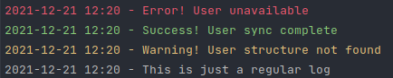

# cLog.js
![author-image]
![js-image]
[![MIT License][license-image]][license-url]

Library for more informative output in the console.log

## Installation

Add the next line in package.json dependencies:
```javascript
"dependencies": {
    ...
    "cLog": "git+https://github.com/ddgryaz/cLog.js.git"
    ...
}
```

## Tutorial

Import cLog into your application:

```javascript
const cLog = require('cLog');

cLog('Error! User unavailable', 'red');
cLog('Success! User sync complete', 'green');
cLog('Warning! User structure not found', 'yellow');
cLog('This is just a regular log');
```

Output:



## License

cLog.js is freely distributable under the terms of the [MIT license][license-url].


[author-image]: https://img.shields.io/badge/Author-Dmitriy%20Dzyuman-blueviolet
[js-image]: https://img.shields.io/badge/Lang-JavaScript-yellow
[license-image]: https://img.shields.io/badge/license-MIT-blue.svg?style=flat
[license-url]: LICENSE